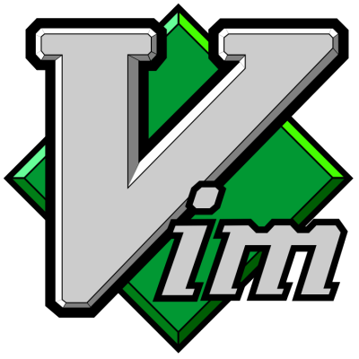

# Copy of the Haroogan Vim Youcompleteme for windows.

## [Vim YouCompleteMe for Windows](https://bitbucket.org/Haroogan/vim-youcompleteme-for-windows)

--------------------------------------------------------------------------------

  
